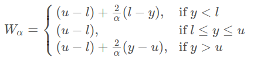

# 資料探勘 Final Project (Group 13)

* 競賽網址：https://www.kaggle.com/competitions/prediction-interval-competition-ii-house-price/overview
* 程式碼：https://github.com/Mere-cat/Hash-Slinging-Slasher/blob/main/model_v2.ipynb
* 結果圖：https://github.com/Mere-cat/Hash-Slinging-Slasher/blob/main/img/model_v2_result.png

---

在迴歸分析中，「點」預測（代表集中趨勢）並不罕見。而在本次比賽中，我們關注的是預測一個「區間」（離散度指標）。

我們的任務是創建一個具有最窄（最「有效」）整體預測區間的迴歸模型。

## Evaluation
使用  Winkler Interval score：



where y is the true value, u is the upper prediction interval, l is the lower prediction interval, and alpha is (100-coverage%)/100.

在這之中，y 是 ground truth，u 和 l 是我們的預測，alpha 固定為 0.1。

==分數越低越好，所以等於是鼓勵模型的上下限越接近越好。==

### Coverage

In this competition the aim is a nominal marginal coverage of 90% (i.e.
**alpha = 0.1**). That is to say that 90% of the prediction intervals contain the true value (y_true).

## Submission file format
你要預測的是每個物件的上下限（而不是單一數值）：
```
id,pi_lower,pi_upper
200000,18000.6,24000.5
200001,21000.3,26000.7
200002,2000.9,4000.1
...
```

## Features
### 資料集所提供的特徵
#### 基本資料
* `sale_date`: 售出日期（DateTime）
* **`sale_price`**: 售出價格（要預測的目標）(number)
* `sale_nbr`: 可能是 sale_number（銷售編號）。(number)

    表示該房屋是第幾次轉售，例如第一次轉售為 1，第二次轉售為 2，類似房屋的歷史銷售次數。多次轉手可能反映出房屋的吸引力（或潛在問題），可與價格或屋齡等欄位一併觀察。
* `sale_warning`: 可能是某種編碼系統，例如房屋交易的「警示代碼」。(string，但內容是數字)

    表示交易過程中有特別狀況，如法院拍賣、短售（short sale）、遺產交易等。空值可能代表該筆交易為一般交易，無警示。

* `join_status`: 房屋在交易時的建築狀態或歷史處理方式。(string)
    * nochg: No Change → 無重大更動，房屋狀況穩定或為原始狀態。
    * miss99: Missing（推測為預設值）→ 有缺失，且資料以「99」代碼補填或占位。
    * reno - before: Renovation before sale → 銷售前有裝修，但尚未完工或尚未反映在其他欄位。
    * reno - after: Renovation after sale → 銷售後裝修，可能尚未納入價格反映。* rebuilt - before: 重建前 → 建物在重建前的狀態（例如售出的是老屋，但已規劃重建）。
    * rebuilt - after: 重建後 → 建物為新建完畢狀態，可能是舊屋拆除後重建的產物。
    * new: 新建案 → 全新房屋，可能是首次上市。
    * demo: Demolished → 房屋已拆除（例如交易的是土地或待開發地產）。

* `join_year`: 加入的年份（number）
* `latitude`: 緯度 (number)
* `longitude`: 經度 (number)
* `area`: 面積 (number)
* `city`: 所處城市 (string)
* `zoning`: Zoning 表示「土地使用分區」，是城市規劃中指定某塊土地允許從事何種用途的規則。(string)

    常見分區代碼有：
	- RS → Residential Single-family（單戶住宅）
	- R-8 → Residential 8 units per acre（每英畝最多 8 戶）
	- RA2.5 → Rural Area 2.5 acres（農業/郊區）
	- NR3, SR-6 等 → 表示特定密度住宅或商業用途
* `subdivision`: 地段/社區名稱。通常與房屋品質、區域規劃和鄰里價值高度相關。 (string)
* `present_use`: 房屋當下的實際用途。 (number)

    有可能經過某種內部編碼，例如：1 → 單戶住宅、2 → 多戶住宅、3 → 商業用途
* `land_val`: 土地估值，不含建物的土地價值。 (number)
* `imp_val`: 建物估值(Improvements Value)，建築物（如房屋）價值。 (number)
* `year_built`: 建造年份。 (number)
* `year_reno`: 整修年份（Year Renovated），代表房屋最近一次整修或翻新的年份。若值為 0 或缺失，可能表示未整修。 (number)
* `sqft_lot`: 基地面積（Lot Size in square feet），房地產基地的大小（包括房子和空地、院子等），以平方英尺為單位。 (number)
* `sqft`: 建築總面積（Total finished square feet），可用室內空間的總面積（如臥室、客廳等），通常不包括地下室。 (number)
* `sqft_1`: 一樓面積（First Floor Sqft），房屋第一層的室內面積（可能包含主客廳、廚房等）(number)
* `sqft_fbsmt`: 已完成裝修的地下室面積 (Finished Basement Sqft)，表示地下室的「已裝修」空間（可正常使用的空間）。(number)

#### 房屋等級
* `grade`: 建築整體等級（Overall Building Grade），通常為 1–13 分級（越高越豪華），反映建材、做工、設計、裝潢的整體水準 (number)
* `fbsmt_grade`: 地下室等級（Basement Grade），評估地下室品質的等級，格式與 grade 類似，但只針對地下室部分。(number)
* `condition`: 房屋狀況（Condition, 1–5）代表房屋的保存狀況。 (number)

    常見的定義如下：
	* 1 = Poor（破舊）
	* 2 = Fair（尚可）
	* 3 = Average（普通）
	* 4 = Good（良好）
	* 5 = Excellent（非常好）

#### 房型
* `stories`: 房屋樓層數，可能出現 1.5（如閣樓）或 2.5（含地下室）(number)
* `beds`: 臥室數 (number)
* `bath_full`: 全套衛浴數（有淋浴與馬桶）(number)
* `bath_3qtr`: ¾ 衛浴（有淋浴、沒浴缸）(number)
* `bath_half`: 半套衛浴（僅馬桶與洗手台）
* `garb_sqft`: 垃圾/儲藏區的面積（可能是雜物區）(number)
* `gara_sqft`: 車庫面積 (number)

#### 附近機能
* `wfnt`: 是否臨水（Waterfront）(bool)
* `golf`: 是否臨高爾夫球場 (bool)
* `greenbelt`: 是否靠近綠帶（保護區/林地）(bool)

#### 視野與交通類別（0–3 或 0–4 的等級）
這類變數是ordinal（序位）變數，用 0 表示無、數字越高代表品質越佳。

* `noise_traffic`: 噪音與交通擾動程度（越高越吵）(number)
* `view_rainier`: 雷尼爾山景觀 (number)
* `view_olympics`: 奧林匹克山景觀 (number)
* `view_cascades`: 喀斯喀特山景 (number)
* `view_territorial`: 一般領土視野（例如廣闊鄉村）(number)
* `view_skyline`: 市中心天際線景觀 (number)
* `view_sound`: Puget Sound（海灣）景觀 (number)
* `view_lakewash`: 華盛頓湖景觀 (number)
* `view_lakesamm`: 薩曼米許湖景觀 (number)
* `view_otherwater`: 其他水景景觀 (number)
* `view_other`: 其他未列出的視野類型 (number)

#### 其他
* `submarket`: 子市場代碼，可能對應不同區域或行政劃分，使用一種字母編碼（A–S + NaN）。 (string)

### Features Engineering (TODO)
* total_val = land_val + imp_val
* land_ratio = land_val / total_val → 越高代表越「地值導向」，多為市中心精華區
* improvement_ratio = imp_val / total_val → 越高代表房子價值占比高，通常是新屋或豪宅
* sqft_lot 和 sqft（屋內面積）做比例可知道土地利用率，太小表示公寓，太大可能是豪宅、農舍
* fbsmt_grade / grade 比例 → 地下室與整屋品質相對關係（若地下室等級高但主屋低，可能為後期加建）
* total_baths = bath_full + 0.75*bath_3qtr + 0.5*bath_half
* is_master_suite = (bath_full > beds * 0.8) 等
* 是否有車庫：has_garage = (gara_sqft > 0)
* 車位數估計：garage_spots ≈ gara_sqft / 200